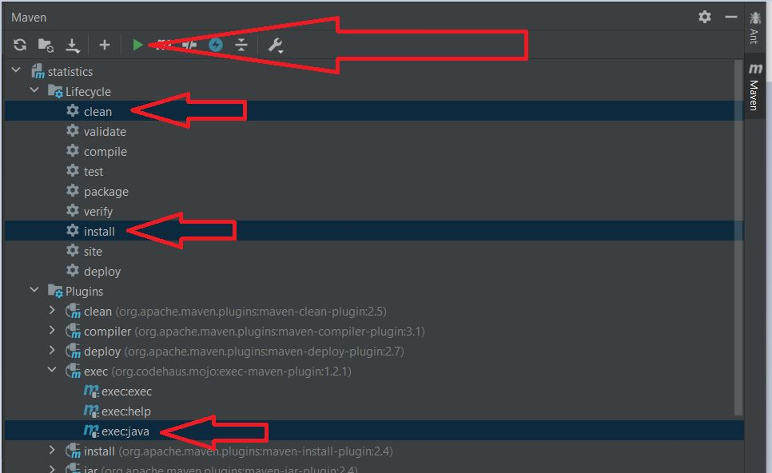

# Overview
This project generates categories statistics from provided data.
It uses Java 11.

## How to run
To run project on the local machine just start main in App class.
```
mvn clean install exec:java
```

Also, you can run the project just like in the picture


## Path to input file
By default, input file stores in the root of project (input.txt).
It is possible to change path to this file in com.Statistics.App.